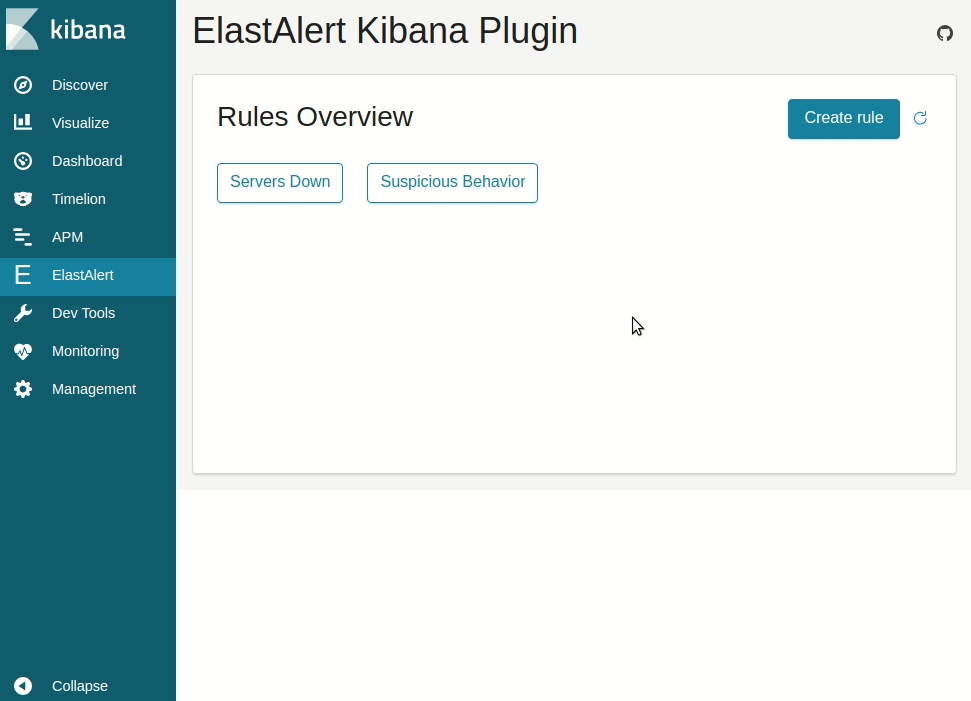

# ElastAlert Kibana Plugin

> This plugin provides a way to create, test and edit ElastAlert rules within Kibana.



---

## Requirements
- Our [ElastAlert](https://github.com/bitsensor/elastalert) fork
- Kibana 6.3.1 or higher

## Installation
Check the [releases](https://github.com/bitsensor/elastalert-kibana-plugin/releases) page to download and install the latest version of this plugin that is compatible with your Kibana version.

## Configuration
By default the plugin will connect to `localhost:3030`. If your ElastAlert server is running on a different host or port add/change the following options in your `config/kibana.yml` file: 

```
elastalert-kibana-plugin.serverHost: 123.0.0.1
elastalert-kibana-plugin.serverPort: 9000
```

## Contribution
Please report any issues or suggestions you have on the [issues page](https://github.com/bitsensor/elastalert-kibana-plugin/issues). If you want to create a pull request please check our [contribution guide](CONTRIBUTING.md).
